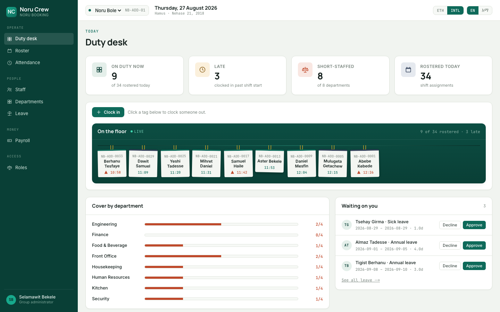
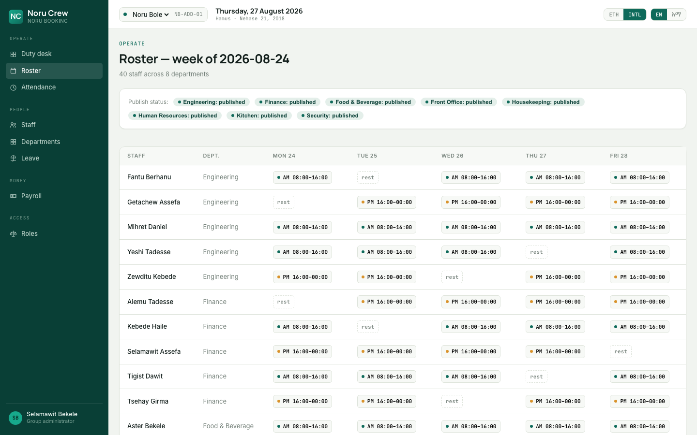
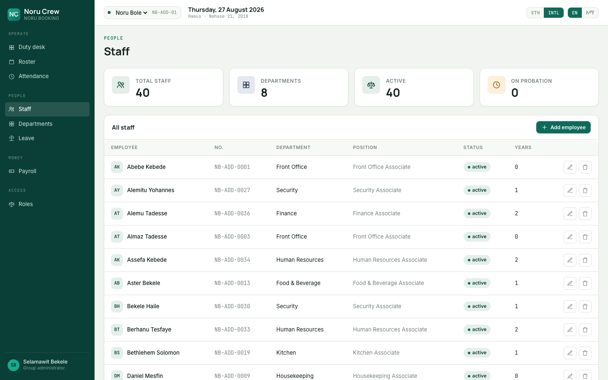
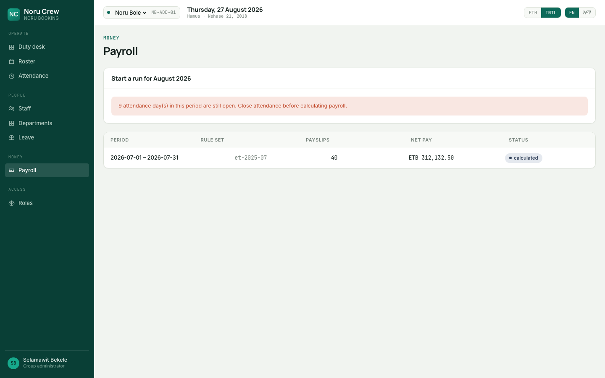

<div align="center">

# Noru Crew

**Staff operations for Noru Booking hotels.**

Rostering, attendance, leave and payroll — built for how hotels in Ethiopia
actually run, not translated from a system that assumes otherwise.

</div>

---

## What this is

Noru Booking runs hotels. Hotels run on people working awkward hours in
overlapping departments, and every hour of that has to end up correctly on a
payslip, correctly withheld, and correctly filed with the Ministry of Revenues
by the 8th of the following month.

Noru Crew is the system that gets it from the staff entrance to the bank file:

| | |
|---|---|
| **Duty desk** | Who's on the floor right now, live, plus coverage by department and leave requests waiting on you |
| **Roster** | Weekly rosters per department, with the Labour Proclamation's rest and hours rules checked before anything is published |
| **Attendance** | Append-only punch log reconciled into daily worked and overtime, split into the four rates Ethiopian law prices separately |
| **Leave** | Annual, sick, maternity, paternity and the rest, on balances that run to the Ethiopian fiscal year |
| **Payroll** | Ethiopian-month runs, PAYE band-by-band, pension, four-eyes approval |
| **Staff, departments, roles** | Directory, org structure and permission sets, with real CRUD on top |

<br>

## See it

<table>
<tr><td colspan="2">

**Sign in** — the enamel-green hero, ported straight from the design system


</td></tr>
<tr>
<td width="50%">

**Duty desk** — the tag board



</td>
<td width="50%">

**Roster** — click a cell to assign or change a shift



</td>
</tr>
<tr>
<td width="50%">

**Staff** — directory with real add/edit/remove



</td>
<td width="50%">

**Payroll** — refuses to calculate while attendance is still open



</td>
</tr>
</table>

---

## Why it looks like this

Two decisions carry most of the interface.

**The Ethiopian date comes first — by default.** Every date leads with
`Hamus · Nehase 21, 2018` and puts `27 Aug 2026` underneath in smaller type.
That is the wrong way round for almost every business system sold in Ethiopia,
and it is the right way round for the people using this one. A toggle in the
topbar swaps which calendar leads — Gregorian gets full international
weekday/month naming when it does — but neither one ever disappears; banks
and suppliers need the Gregorian date regardless of which is primary.

**The palette is enamelware, not the flag.** Green, gold and red aimed at an
Ethiopian audience defaults to a flag, and a flag on a payroll screen is
decoration pretending to be localisation. The colours here come from the objects
the building is full of: the deep painted green of a *rekebot* coffee tray, the
ochre of teff roasting, the red of berbere. On a cool grey-green paper they read
as pigment, not as UI accent.

Type is **Inter**, **Manrope** and **JetBrains Mono**, with **IBM Plex Sans
Ethiopic** as the Amharic companion face so bilingual labels sit at a
comparable weight without a jarring font swap mid-sentence.

And one thing that is simply enjoyable: the **tag board**. Every hotel
back-of-house has a rack of numbered tags by the staff entrance that you flip
when you come on shift. The duty desk opens with that rack — brass hooks, a
slight tilt, department colour on the top edge. It is the one element allowed to
be literal. Everything else stays quiet so it can carry the personality.

---

## Ethiopia is in the schema, not in a locale file

Localisation here is not a translation layer bolted onto a system that assumes
Western defaults. Most of it is structural.

**Names have no surname.** People are known by a given name, their father's
name and their grandfather's name. All three are needed for tax and pension
filings; the first two go on a roster; directories sort by the *given* name.
There is no `last_name` column and adding one would be a bug, not a feature.

**Thirteen months.** Twelve of thirty days, then Pagume of five or six. Payroll
periods are Ethiopian months. The fiscal year opens on Hamle 1. Leave balances
accrue against it. Conversion goes through Julian Day Numbers and is exact —
`src/lib/domain` round-trips every date from 1900 to 2100 with no mismatches
(verified by the test suite, not just asserted).

**Six hours out.** The Ethiopian clock counts from dawn, so 07:00 is *1:00
ጠዋት*. A night porter reads their shift as starting at *4:00 ለሊት*. The system
stores UTC, computes in wall-clock, and displays whichever the user has chosen.

**Money is santim.** Integer minor units in `bigint` columns, every one of them
named `*_santim`. There is no floating-point number anywhere near a payslip.

**Tax law is versioned data, not code.** Employment income tax was rewritten by
**Proclamation 1395/2025**, effective 7 July 2025 — the tax-free threshold went
from ETB 600 to ETB 2,000 and seven bands became six. Both that rule set and the
superseded 979/2016 one live as rows with effective dates. Recalculating a
payslip from 2016 EC uses the law that applied then, because that is the only
way an audit or a labour dispute can be answered honestly. The payroll module
shows the working band by band, not just the total.

| Monthly taxable | Rate |
|---:|---:|
| 0 – 2,000 | 0% |
| 2,000 – 4,000 | 15% |
| 4,000 – 7,000 | 20% |
| 7,000 – 10,000 | 25% |
| 10,000 – 14,000 | 30% |
| above 14,000 | 35% |

**Pension does not reduce the tax base.** 7% employee, 11% employer, uncapped,
on basic salary only (Proclamation 715/2011). Both PAYE and pension are assessed
on their own bases, independently. Porting logic from a neighbouring country
gets this wrong and quietly underpays tax on every payslip.

**Overtime has four prices**, not one (Proclamation 1156/2019, Arts. 67–68):

| When | Multiple |
|---|---:|
| Daytime | 1.5× |
| Night, 22:00–06:00 | 1.75× |
| Weekly rest day | 2.0× |
| Public holiday | 2.5× |

A shift crossing 22:00 is split at the boundary and each part priced
separately. Caps of 2h/day, 20h/month and 100h/year are *flagged loudly and
still paid* — an employer breaking the ceiling owes the money regardless, and a
system that silently withheld it would be helping with the wrong problem.

**Holidays are a table, not a constant.** Orthodox feasts move with the
Ethiopian calendar; Eid al-Fitr and Eid al-Adha are gazetted after the moon is
sighted. An unconfirmed holiday inside a roster week blocks publishing, because
hours worked on a gazetted holiday cost 2.5× and nobody should find that out
afterwards.

Also in the model: Fayda national ID and 10-digit TIN, `+251` phone
normalisation, region/sub-city/woreda addresses, work permits for non-Ethiopian
staff, and a minimum working age of 15 enforced by a `CHECK` constraint.

---

## Architecture

A single Next.js 15 app. Server Components query Postgres directly; mutations
go through Server Actions where they're wired up. No separate API process.

```
noru-crew/
├── src/
│   ├── app/                 App Router. (auth)/login, (app)/ the authenticated shell
│   │   └── (app)/             duty desk, roster, attendance, staff, departments,
│   │                          leave, payroll, roles — one route per module
│   ├── components/          TagBoard, AppShell, and the interactive client
│   │                        components (RosterGrid, StaffTable, PayrollRunActions…)
│   ├── lib/
│   │   ├── domain/            Pure domain logic. Zero dependencies, no I/O.
│   │   │   ├── ethiopian-calendar   JDN conversion, fiscal year, 13 months
│   │   │   ├── ethiopian-time       dawn-based clock
│   │   │   ├── money                santim, allocation without rounding loss
│   │   │   ├── names                three-part names, phone, TIN
│   │   │   ├── payroll/             versioned rules, PAYE, pension, overtime, payslip
│   │   │   ├── leave/               entitlement, sick-pay taper
│   │   │   └── scheduling/          rest, hours, coverage rules
│   │   ├── db/                 connection, tenant scoping (withScope), migration
│   │   │                       runner, seed script
│   │   ├── local-store.ts      the local-only CRUD overlay (see below)
│   │   └── schemas.ts          Zod schemas
│   └── globals.css          the enamelware design system
│
├── db/migrations/           Forward-only, checksummed SQL. Six files: schemas,
│                            people, operations, payroll, RLS + views, seed data.
└── docs/                    Architecture, data model, localisation, ADRs.
```

**Why a monolith.** Payroll reads attendance, which reads rosters, which read
contracts and leave. Splitting that across services buys distributed
transactions and buys nothing else. The module boundaries are real; if one ever
needs to leave, the seam is already cut.

**Why the domain is pure.** `src/lib/domain` has no database handle, no clock, no
config. Tax arithmetic and rest-period rules are the parts that must be provably
correct, and they are testable by calling a function with numbers. That is why
the test suite runs in under a second and why the calendar could be verified
across two centuries.

**Why SQL migrations rather than an ORM.** The schema leans hard on Postgres:
`EXCLUDE` constraints with GiST that make double-booking a shift *unrepresentable*,
generated columns, row-level security, partial indexes, `citext`. An ORM's
migration DSL cannot express most of that, so it would be hand-written SQL
inside a wrapper anyway. This skips the wrapper.

### Correctness lives in the database

The application checks these too, for a decent error message. The database is
what makes them true.

- One employee cannot hold two overlapping shifts — `EXCLUDE USING gist`
- Contracts for one employee cannot overlap in time — same mechanism
- A payroll run cannot be approved by whoever calculated it — `CHECK (approved_by <> calculated_by)`
- A payslip's components must sum to its net — `CHECK`
- Punches and audit events cannot be updated or deleted — `REVOKE`
- Nobody reads another property's data — row-level security, with the tenant set
  per transaction so a pooled connection cannot leak it
- Salary is invisible without `salary.read`, in the database, not just the UI

### Two operational rules worth stating

**Attendance must be closed before payroll can calculate.** Not a warning — a
precondition failure that names how many days are still open. The Payroll page
checks this live: try starting a run for an open period and it refuses with the
exact count, the same way the database would.

**Approval needs a second person.** Enforced by a database `CHECK`, so it
survives someone calling the write path directly — and the app seeds a distinct
finance-approver principal specifically so this has a real second person to
demonstrate against, not just a label.

### What's real, and what's a local-only demo

Everything you read on every page — staff, rosters, attendance, leave balances,
payroll figures, the band-by-band PAYE working — comes from live Postgres
queries against seeded data. Nothing on screen is fabricated.

What *doesn't* persist: there's no session/auth flow yet (BUILD-PROMPT step 5),
so there's no principal to attribute a write to and no write API wired up.
Interactive actions — clock in/out, assigning a shift, approving leave or a
payroll run, editing a staff record — apply on top of the real server data
through a small `localStorage` overlay (`src/lib/local-store.ts`) instead, and
every surface that does this says so. Clear your browser storage and it's back
to exactly what's in the database.

---

## Running it

Requires Node 22+, pnpm 9+, Docker.

```bash
pnpm install
cp .env.example .env.local
node -e "console.log(require('crypto').randomBytes(32).toString('base64url'))"  # paste into SESSION_SECRET

pnpm db:up          # postgres + migrations
pnpm seed           # one property, 40 staff, a locked month of attendance, a payroll run
pnpm dev
```

App on `:3000`. Demo login is shown by the seed script (`admin@noru.local`) —
there's no auth flow yet to actually sign in with, see above.

```bash
pnpm verify         # typecheck + lint + test
pnpm db:reset       # drop, migrate, reseed
```

---

## Honest status

**Verified by execution, not just asserted.** The Ethiopian calendar
conversion, round-tripped across 1900–2100 with zero mismatches. The PAYE and
pension arithmetic, computed band by band against hand-worked examples. The six
migrations, applied against a real Postgres — two real bugs were found this way
(an ambiguous column reference in the seed data, a double-JSON-encoding bug in
how tax bands were stored) and fixed forward, never patched in place. `pnpm
verify` and `pnpm build` are both clean.

**Please verify the tax bands with the Ministry of Revenues.** The source used
for Proclamation 1395/2025 was a secondary tax guide. The figures are
internally consistent and match published worked examples, but this is the one
number in the system where being wrong is expensive.

**Not built yet.** Real auth (session cookies, argon2, RBAC middleware); the
attendance reconciliation pipeline that would turn raw punches into
`ops.attendance_days` (the seed writes reconciled rows directly); persisting
any of the interactive actions described above; PDF payslips; bank file export.
`docs/` and `CLAUDE.md` describe how these are meant to fit.

---

## Documentation

| | |
|---|---|
| [`CLAUDE.md`](CLAUDE.md) | How to work in this repo. Invariants, conventions, and the things never to do |
| [`docs/architecture.md`](docs/architecture.md) | Layers, module boundaries, request lifecycle |
| [`docs/data-model.md`](docs/data-model.md) | Schema by schema, and why each constraint exists |
| [`docs/localization-ethiopia.md`](docs/localization-ethiopia.md) | Calendar, names, money, tax, labour law, with sources |
| [`docs/adr/`](docs/adr/) | Decisions, with what was given up |

---

<div align="center">
<sub>Built for Noru Booking · <code>ኑሩ ክሩ</code></sub>
</div>
